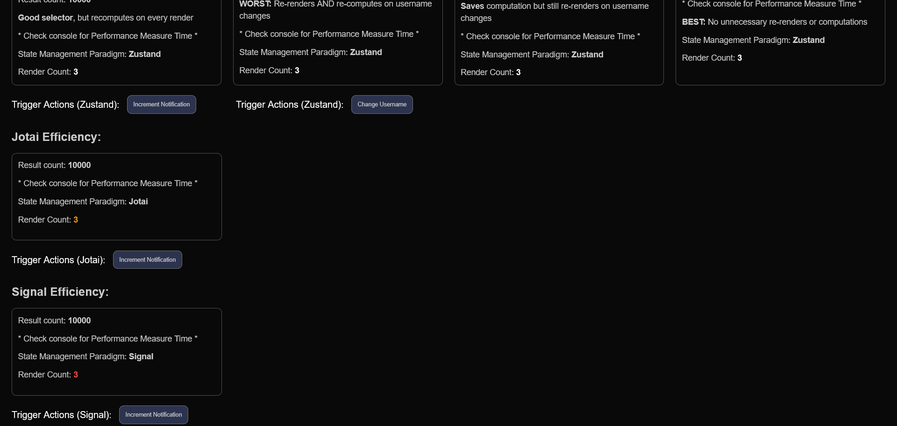
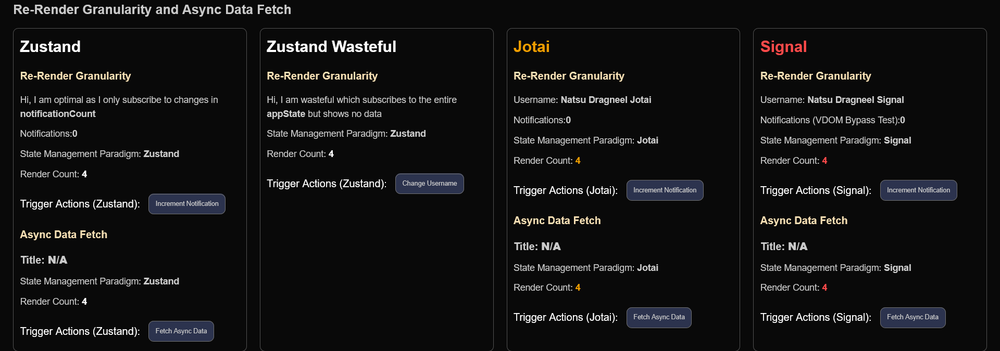
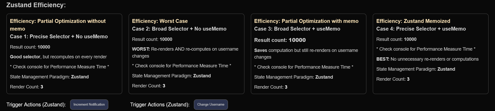
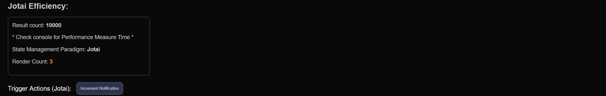
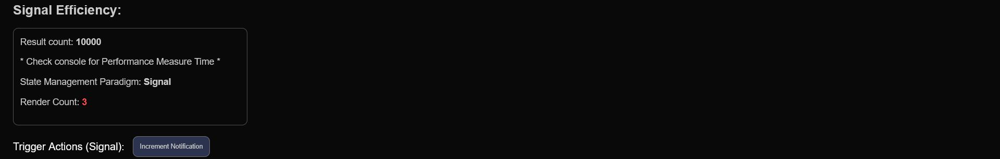

# Methodology

## Testing Approach

This document details the methodology used to compare Zustand, Jotai, and Preact Signals across three critical dimensions: granularity, efficiency, and async flow patterns.

## Test Environment

### Application Architecture

- Three-column layout with identical functionality
- Each column implements the same features using a different paradigm
- Visual render counters using `useRef` to track component re-renders
- Performance timing using `performance.mark()` and `performance.measure()`



## Metric 1: Re-render Granularity

### Objective

Demonstrate how each paradigm handles component re-renders when state changes, particularly when components subscribe to state they don't actually use.

### Implementation

#### Visual Render Counter

This is a utility component that computes the number of re-renders.

```javascript
export const RenderCounter = ({ storeKey, children }) => {
  const countRef = useRef(0);
  countRef.current = countRef.current + 1;

  return (
    <div>
      {children}
      <p>
        Render Count: <strong>{countRef.current}</strong>
      </p>
    </div>
  );
};
```

#### Test Scenarios

**Zustand - Optimal Selector:**

```javascript
const count = useZustandStore((state) => state.appState.notificationCount);
```

- Subscribes only to `notificationCount`
- Should not re-render when `userName` changes

**Zustand - Wasteful Selector:**

```javascript
const appState = useZustandStore((state) => state.appState);
```

- Subscribes to entire `appState` object
- Will re-render on ANY property change due to immutable updates

**Jotai - Atomic Subscription:**

```javascript
const count = useAtomValue(notificationCountAtom);
```

- Automatically subscribes only to `notificationCountAtom`
- Architectural guarantee of granular subscriptions

**Signals - Direct Read:**

```javascript
const count = sig_notificationCount.value;
```

- Tracks dependency on specific signal
- VDOM bypass for maximum efficiency

### Test Actions

1. Initial render (baseline: 1)
2. Click "Increment Notifications" 5 times (expected: +5 renders for components displaying notifications)
3. Click "Change Username" 3 times (wasteful selectors will re-render, optimal will not)

### Expected Outcomes

- **Zustand Optimal**: 6 renders (1 initial + 5 notification changes, 0 wasteful)
- **Zustand Wasteful**: 9 renders (1 initial + 5 notification changes + 3 wasteful username changes)
- **Jotai**: 6 renders (automatic granularity)
- **Signals**: 1 render (VDOM bypass means component function doesn't re-run)

## Metric 2: Async Flow Architecture

### Objective

Demonstrate where sequential state update logic lives in each paradigm.

### Implementation

#### Zustand - Centralized Actions

```javascript
export const useZustandStore = create((set) => ({
  asyncData: null,
  isLoading: false,

  fetchData: async () => {
    set({ isLoading: true });
    console.log('ZUSTAND: 1. Loading: true');
    await new Promise((resolve) => setTimeout(resolve, 1000));
    set({ asyncData: { title: 'Zustand Data Fetched' }, isLoading: false });
    console.log('ZUSTAND: 2. Data Set, Loading: false');
  },
}));
```

- Logic resides in the store
- Components call the action: `useZustandStore.getState().fetchData()`

#### Jotai - Write-Only Atom

```javascript
export const asyncDataWriteAtom = atom(null, async (get, set) => {
  set(isLoadingAtom, true);
  await new Promise((resolve) => setTimeout(resolve, 1000));
  set(asyncDataAtom, { title: 'Jotai Data Fetched' });
  set(isLoadingAtom, false);
});
```

- Logic resides in a write-only atom
- Components use: `const fetch = useSetAtom(asyncDataWriteAtom)`

#### Signals - External Functions

```javascript
export const fetchSignalData = async () => {
  sig_isLoading.value = true;
  await new Promise((resolve) => setTimeout(resolve, 1000));
  sig_asyncData.value = { title: 'Signal Data Fetched' };
  sig_isLoading.value = false;
};
```

- Logic resides in exported functions
- Components import and call directly: `fetchSignalData()`

### Console Logging

Each implementation logs:

1. When loading state is set to true
2. When data is fetched and loading is set to false

This demonstrates the execution flow and confirms sequential updates.

### Component Re-renders During Async Flow

All three paradigms were tested with optimal selectors/subscriptions:

**Test Setup:**

- Component subscribes to `isLoading` and `asyncData` only
- Does not subscribe to unrelated state (username, notifications, etc.)

**Expected Result:** 2 renders per fetch

1. First render: `isLoading` changes to `true`
2. Second render: `asyncData` updates and `isLoading` changes to `false`

This confirms that with proper implementation, all three paradigms achieve optimal re-render granularity for async flows.



## Metric 3: Computational Efficiency

### Objective

Measure how each paradigm handles expensive derived state and whether memoization is automatic or requires manual implementation.

### Implementation

#### Expensive Filter Operation

All three paradigms implement the same expensive computation:

```javascript
const MOCK_DATA = Array.from({ length: 100000 }, (_, i) => ({
  id: i,
  value: i % 10,
}));

// Expensive filter that takes ~1.5ms
const result = filter(MOCK_DATA, (item) => item.value === count % 5);
```

#### Zustand Implementation - Four Cases

**Case 1: Precise Selector + No useMemo**

```javascript
const count = useZustandStore((state) => state.appState.notificationCount);
const filtered = expensiveFilter(count); // Runs on every render
```

**Case 2: Broad Selector + No useMemo (WORST)**

```javascript
const appState = useZustandStore((state) => state.appState);
const filtered = expensiveFilter(appState.notificationCount); // Runs on unnecessary renders
```

**Case 3: Broad Selector + useMemo**

```javascript
const appState = useZustandStore((state) => state.appState);
const filtered = useMemo(
  () => expensiveFilter(appState.notificationCount),
  [appState.notificationCount]
);
```

**Case 4: Precise Selector + useMemo (OPTIMAL)**

```javascript
const count = useZustandStore((state) => state.appState.notificationCount);
const filtered = useMemo(() => expensiveFilter(count), [count]);
```



#### Jotai Implementation

```javascript
export const expensiveFilterAtom = atom((get) => {
  const count = get(notificationCountAtom);
  performance.mark(`Jotai_Filter_Start_${count}`);
  const result = filter(MOCK_DATA, (item) => item.value === count % 5);
  performance.mark(`Jotai_Filter_End_${count}`);
  return result;
});
```

- Derived atom automatically memoizes
- Computed once per state change
- All components share the cached result



#### Signals Implementation

```javascript
export const expensiveComputedSignal = computed(() => {
  const count = sig_notificationCount.value;
  performance.mark(`Signal_Filter_Start_${count}`);
  const result = filter(MOCK_DATA, (item) => item.value === count % 5);
  performance.mark(`Signal_Filter_End_${count}`);
  return result;
});
```

- Computed signal automatically memoizes
- Updates once per state change
- All components read the cached value



### Performance Tracking

```javascript
performance.mark('Start');
// ... expensive operation ...
performance.mark('End');
performance.measure('Duration', 'Start', 'End');
```

Console logs track:

1. When the expensive computation runs
2. Which state change triggered it
3. Cumulative time spent in computation

### Test Actions

1. Initial render (count = 0)
2. Increment notifications 3 times
3. Change username 2 times (should NOT trigger computation)
4. Increment notifications 1 more time

### Expected Outcomes

**Necessary computations:** 4 (initial + 3 increments + 1 final increment)

**Zustand Case 1:** 4 executions (good, but vulnerable to parent re-renders)  
**Zustand Case 2:** 6 executions (4 necessary + 2 wasteful from username changes) = 33% waste  
**Zustand Case 3:** 4 executions (useMemo prevents wasteful computation, but still re-renders)  
**Zustand Case 4:** 4 executions (fully optimized)  
**Jotai:** 4 executions (automatic)  
**Signals:** 4 executions (automatic)

## Data Collection Methods

### Render Count Collection

- `useRef` counter increments on every component function execution
- Displayed in real-time in the UI
- Reset on page reload for consistency

### Performance Timing Collection

- `performance.mark()` called before expensive operation
- `performance.mark()` called after expensive operation
- `performance.measure()` calculates duration
- Data collected from browser DevTools Performance tab

### Console Log Collection

- All state changes logged with timestamp
- Computation executions logged with state value
- Color-coded by paradigm for easy identification
- Formatted output for readability

## Limitations and Considerations

### Test Scope

- Synchronous updates only (no concurrent rendering)
- Single browser environment (Firefox)
- Simple component tree (no deeply nested context)
- Mock data (100000 items, predictable computation time)

### Real-World Differences

- Production apps have more complex component trees
- Actual expensive operations vary widely (network calls, complex transformations)
- User interaction patterns differ from controlled tests
- Multiple components may share the same derived state

### Zustand Variability

Results depend heavily on:

- Developer discipline in writing precise selectors
- Consistent use of useMemo for expensive computations
- Code review practices to catch optimization issues

### Jotai and Signals Consistency

- Results are deterministic due to architectural guarantees
- Less dependent on developer optimization knowledge
- Performance is predictable across team members
